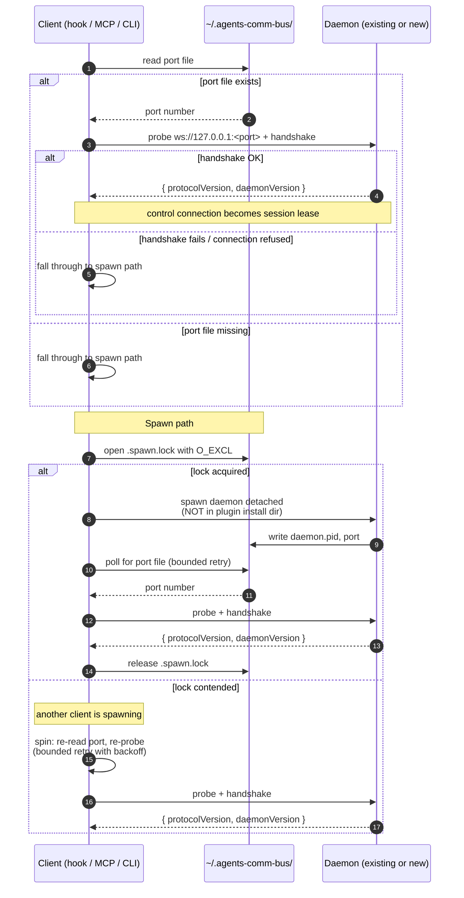

# Sequence: Daemon bootstrap (`ensureDaemon()`)

This document describes how a client (a hook, an MCP server, a CLI tool)
acquires a working connection to the agents-comm-bus daemon. The contract
is: every client calls `ensureDaemon()` at startup, and either gets back a
live WebSocket connection or an error. The client does not need to know
whether the daemon was already running, was just spawned, or was spawned
concurrently by another client.

For the on-disk layout this bootstrap relies on, see
[storage layout](./storage-layout.md). For the invariant that the daemon's
state directory is never inside a plugin install root, see the
*daemon state never lives under plugin install paths* entry in
[invariants](./invariants.md).

## Flow



## Stale PID recovery

If the port probe fails AND a `daemon.pid` file exists, the client checks
whether that PID is still alive:

```mermaid
sequenceDiagram
    autonumber
    participant C as Client
    participant FS as ~/.agents-comm-bus/
    participant OS as OS

    C->>FS: read daemon.pid
    FS-->>C: pid
    C->>OS: is process <pid> alive?
    alt dead
        C->>FS: unlink daemon.pid, port
        C->>C: enter spawn path
    else alive but not responding
        C->>C: bounded wait + retry<br/>(daemon may be starting)
        alt still unresponsive after timeout
            C->>C: error "daemon unhealthy"<br/>(do NOT kill; surface to user)
        end
    end
```

Note that the client **does not kill an unresponsive-but-alive daemon**.
That is an operator decision. The client surfaces the unhealthy state and
exits; the user can `kill` and retry.

## Handshake

The handshake exchanges three pieces of version information:

1. **Protocol version.** Wire protocol of the daemon ↔ client RPCs.
   Incompatible major versions cause the client to refuse the connection
   with a clear error.
2. **Daemon version.** Reported for diagnostics.
3. **Client version.** Reported by the client so the daemon can refuse
   ancient clients if the protocol has tightened.

The protocol version is what governs compatibility. Daemon and client
versions are diagnostic only.

## Why a lock file

Two clients starting concurrently (e.g. two Claude sessions opening at the
same moment) would both find no `port` file and both try to spawn. The
`O_EXCL` create on `.spawn.lock` ensures exactly one wins the spawn; the
loser spins on port-file presence and re-probes the daemon the winner is
in the middle of starting. This avoids the "two daemons fighting over the
same SQLite file" failure mode.

## Detachment

The spawned daemon must be fully detached from the spawning client. On
Windows that means `DETACHED_PROCESS` + `CREATE_NEW_PROCESS_GROUP` (or the
`Start-Process` equivalent used by the existing watcher); on POSIX it
means a double-fork + `setsid`. The daemon must outlive any single Claude
session, any single MCP server restart, and any plugin reinstall.

The daemon's working directory after detach is `~/.agents-comm-bus/`, not
the plugin install path. See the v4 non-negotiable: *daemon state never
lives under plugin install paths*.
