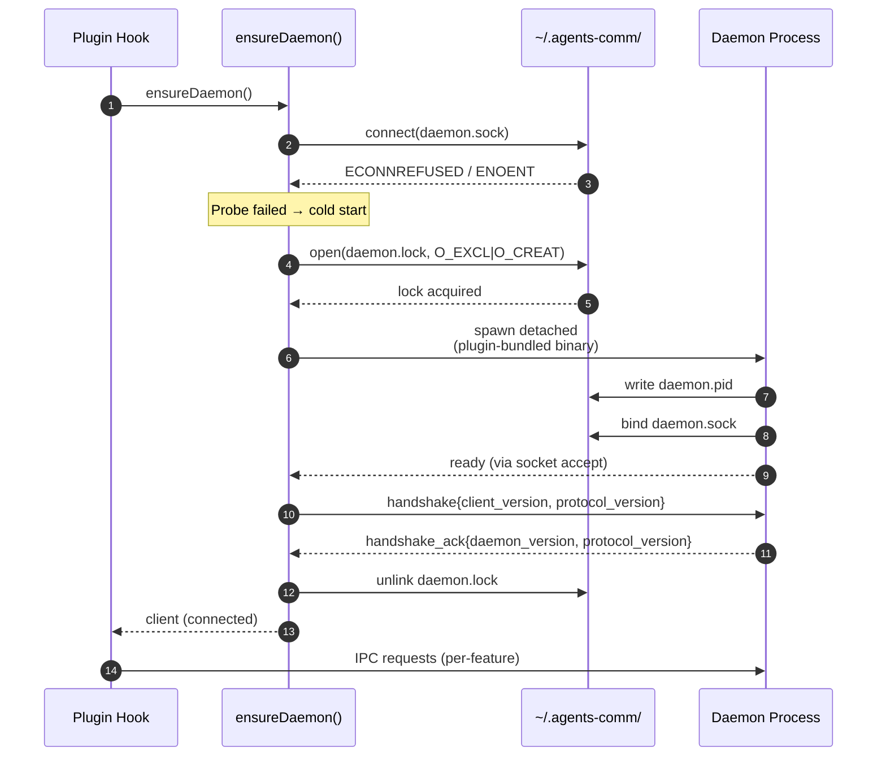
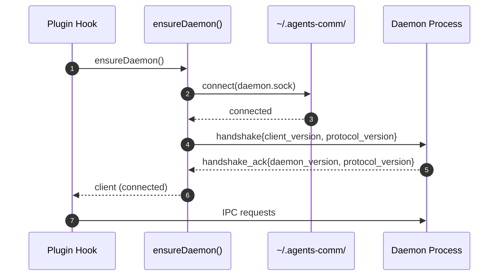
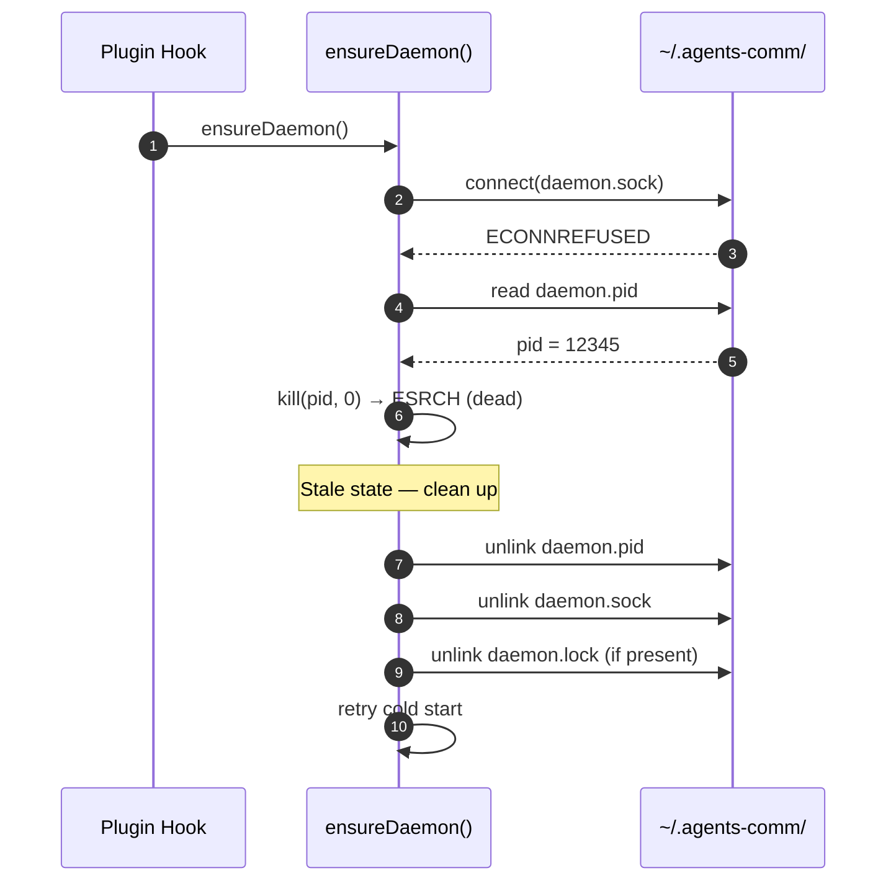

# Sequence: Daemon Bootstrap

Cold-start and warm-start paths for `ensureDaemon()`. The daemon is a per-user
singleton keyed on `(user, AGENTS_COMM_HOME)`; any hook activation in any
project calls `ensureDaemon()` and either attaches to the existing daemon or
spawns one.

## Cold start (no daemon running)

## Warm start (daemon already running)

## Crash recovery (stale pidfile + dead socket)

## Notes

- **Socket probe is the source of truth for liveness.** A pidfile is only
  consulted to identify a dead daemon for cleanup; we never trust it to mean
  "alive."
- **`O_EXCL` lockfile races safely.** Two hooks racing to bootstrap will both
  probe-fail; whichever loses the `O_EXCL` open retries the socket probe in a
  short loop and attaches to the daemon the winner spawned.
- **Daemon is spawned detached from the plugin-bundled binary.** The hook
  process can exit immediately after handshake; the daemon outlives it.
- **Handshake is mandatory on every connect.** Mismatched protocol versions
  fail loudly with an actionable upgrade message rather than degrading silently.
- **Lockfile is released after handshake**, not after spawn — so a daemon that
  spawns but fails to handshake doesn't leave a permanently-held lock.
