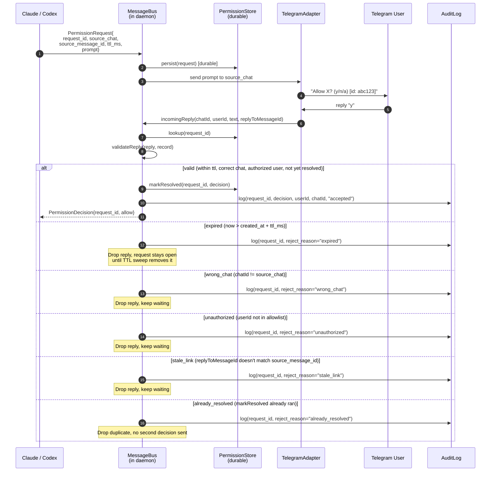

# Sequence: Permission Round-Trip

Permission prompts flow agent → bus → comm → user → bus → agent. Every reply is
validated against a server-side record (request_id, source chat, TTL,
authorization) so the bus can reject stale, mis-routed, or unauthorized replies
without ever forwarding a wrong decision back to the agent.

## Notes

- **Durability survives daemon restart.** The persisted record in
  `PermissionStore` means a `y` arriving after a daemon crash + restart still
  resolves the original request. The agent side may need to re-issue if it also
  restarted, but the bus never silently swallows a valid reply.
- **`stale_link` example.** If a user scrolls up and replies to an *earlier*
  permission prompt that's already been answered (or to a prompt for a
  different `request_id`), the `replyToMessageId` won't match the live record
  and the reply is dropped. Without this check, an out-of-order reply could
  satisfy a fresh, unrelated prompt.
- **Audit log entry on every decision** — including rejections. This is
  Invariant 10 and is the basis for after-the-fact accountability when a
  permission outcome is disputed.
- **Default-deny TTL sweep.** Requests not resolved within `ttl_ms` are reaped
  by a periodic sweep that emits a synthetic `denied(timeout)` decision back to
  the agent so it doesn't hang forever.
