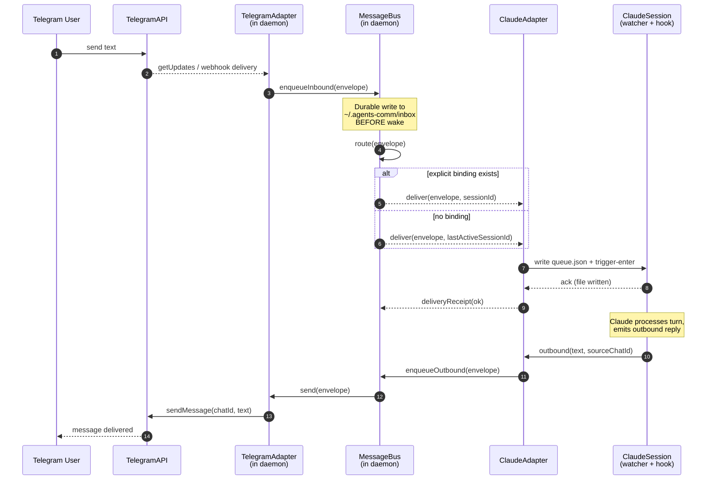

# Sequence: Telegram → Claude

Inbound flow when a Telegram user sends a message that should reach a Claude
session. The `TelegramAdapter` and `MessageBus` both live inside the per-user
daemon process; the `ClaudeAdapter` straddles the daemon (routing side) and the
target Claude session (delivery side, via the existing watcher + hook IPC).

## Notes

- **Durable enqueue happens before wake.** The bus persists the inbound
  envelope to `~/.agents-comm/` before any attempt to wake the Claude session.
  If the daemon or session crashes between enqueue and delivery, the message is
  redelivered on restart — no inbound is ever silently lost.
- **Routing is deterministic.** The bus first consults explicit
  `(commChatId → sessionId)` bindings; only if no binding exists does it fall
  back to the last-active session for that `(comm, account)` pair.
- **Outbound replies travel the same adapter.** The Claude session never talks
  to the Telegram API directly; outbound text is enqueued onto the bus and
  emitted by the same `TelegramAdapter` instance that owns the polling
  connection, preserving the one-comm-owner-per-`(comm, account)` invariant.
- **Per-chat reply targeting** is preserved by carrying `source_chat_id` on the
  inbound envelope; the outbound envelope echoes it so the bus knows where to
  route the reply without reusing last-active.
