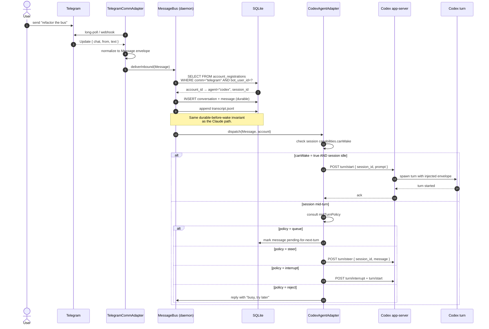

# Sequence: Telegram inbound → Codex

This document describes the inbound path for a user message arriving on
Telegram and being delivered to a Codex agent session. The first half is
identical to the [Claude inbound path](./sequence-telegram-to-claude.md) — the
divergence is at the **wake** step, where Codex is woken via a `turn/start`
app-server RPC instead of a watcher keystroke.

The point of this document is to make the *perpendicularity* of comms and
agents concrete: the same `TelegramCommAdapter` feeds both Claude and Codex
without modification. Only the agent adapter changes.

See [invariants](./invariants.md) for the rules that hold across all agent
adapters, and [storage layout](./storage-layout.md) for the schema referenced
below.

## Flow

## canWake capability

Each agent adapter declares its capabilities at registration time. The
`canWake` capability means "this agent can be started from a cold idle state
by the daemon without user action." Claude (via watcher PostMessage) and Codex
(via `turn/start`) both have `canWake: true`. Other potential adapters — for
example a passive REPL or a notebook agent that only runs when a human
explicitly hits run — would set `canWake: false`, and inbound messages would
be queued for the next user-initiated turn instead of triggering a wake.

## midTurnPolicy

When a message arrives while a Codex turn is already in flight, the daemon
consults the session's `midTurnPolicy`:

| Policy      | Behavior                                                                                    |
|-------------|---------------------------------------------------------------------------------------------|
| `queue`     | Persist now, deliver on next turn boundary. Safe default.                                   |
| `steer`     | Inject the message into the running turn via `turn/steer` (Codex-specific).                 |
| `interrupt` | Cancel the current turn and start a new one with the inbound message.                       |
| `reject`    | Reply to the comm with a "busy" message; do not deliver until the next turn starts cleanly. |

Claude has no equivalent in V1 — the watcher always types into whatever prompt
is visible — so the Claude adapter effectively pins to a degraded `steer`-ish
behavior. Codex exposes the full policy menu because its app-server has
first-class turn lifecycle hooks.

## Perpendicularity

Notice that nothing in the first half of this diagram (steps 1–7) is
Codex-specific. The comm adapter, the bus, the DB schema, and the routing
lookup are identical to the Claude flow. This is the **agents ⊥ comms**
property: comm adapters only need to know how to normalize their wire format
into a `Message` envelope; agent adapters only need to know how to deliver
an envelope into their agent. Adding a new comm (Slack, Discord, IRC) or a
new agent (Aider, an in-house LLM CLI) is one new adapter, not a quadratic
explosion of pairings.
