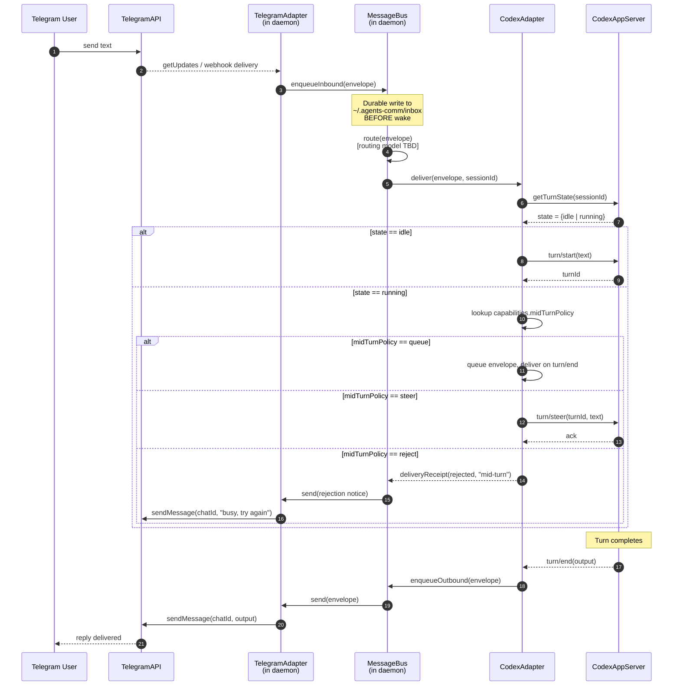

# Sequence: Telegram → Codex

Inbound flow for Codex, which exposes an app-server with explicit `turn/start`
semantics rather than a console session that's woken by a watcher. The bus
consults `AgentCapabilities.midTurnPolicy` to decide what to do when a message
arrives while a turn is already in progress.

## Notes

- **Wake mechanism differs from Claude.** Codex doesn't have a console-attached
  watcher; the adapter calls `turn/start` on the app-server directly. The bus
  layer is unchanged — only the agent-side delivery path differs.
- **`midTurnPolicy` is a capability, not a global setting.** Each
  `AgentCapabilities` declaration specifies how to handle inbound while a turn
  is running. Bus and adapter both consult it so the same envelope is handled
  consistently regardless of which queue path it takes.
- **Durable enqueue still precedes wake.** Same invariant as the Claude flow:
  the inbound is on disk before the adapter touches the app-server, so a crash
  between enqueue and `turn/start` doesn't lose the message.
- **Outbound on `turn/end`.** Codex emits its reply when the turn completes;
  the adapter wraps it as an outbound envelope so it travels the same bus →
  TelegramAdapter path as a Claude reply.
